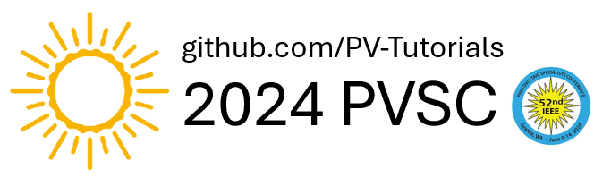

# 2024 PVSC Python Tutorial
Welcome! The goal of this tutorial is to introduce attendees to open-source modeling of PV systems and their production.
The tutorial is divided into 3 sections:

## Section 1: 1.25 hr
This section will introduce the tutorial facilitators, the Jupyter and Google-Collab platform, and python. Then we will proceed to a working example.
The working example will have you use an APIs to download weather data, and use this to model sun position and hten irradiance at surface of a module (POA). 
We will wrap up with modeling module's temperature.
This is covered by tutorials 0 - 2.
* **Tutorial 0**: Overview
* **Tutorial 1**: TMY Weather Data
* **Tutorial 2**: POA Irradiance and Module Temperature

## Section 2: 1 hr
This will be a problem based learning, where you will calculate a pv module power output by taking code from section 1, and adding new code from the documentation provided.
This section will be in small teams created during the session based on skill level. Facilitators will roam around supporting.
This is covered by tutorial PBL 1.
* **Tutorial PBL - 1**: Model power output of a module

## Section 3: 0.5 hrs
We will go over other open-source tools, and examples available in this tutorial for you to peruse afterwards.

We hope that at the end of this tutorial you will
-Have a basic understanding of python, how to run it in the online platform.
-Be able to identify and use source of weather data, even through a fancy API.
-Know how to code-- in other words copy and paste, and read documentation-- for four functions from Pvlib.
-Have enough knowledge to do the appendix tutorials on your own if you want to deepen your knowledge
-Have a clearer understanding of what pvlib does, and what other open source tools are there for you to use.

## Appendix Tutorials:
* **Tutorial A**: Model output power from a single module
* **Tutorial B**: Combine modules to form strings, calculate inverter efficiency
  and total array output
* **Tutorial C**: Single diode model 
* **Tutorial D**: Open-source tool: pvfree
* **Tutorial E**: Using the powerful due-diligence software SAM via pySAM

* **Tutorials Appendices**: More tutorials on a variety of fun topics

## What you will need for the tutorial during the live session (June 9th) 

During this tutorials, we hope you get to play with the code. A laptop is ideal, but we have had students doing them through their phones or tablets, or joining in with a peer. 
You will NOT have to install anything on your computer if you don't want, as we will be running the tutorial in Google Collab. However, you WILL need to be logged-in to a google account to run the tutorials online.
Alternatively, you can install on your computer (instructions below).


## Tutorial Setup
These tutorials are made with [Jupyter](https://jupyter.org), which is a
browser based interactive Python notebook that allows you to run the tutorials
in the cloud without any additional setup. On the day of the tutorial, we will
use [Google Colaboratory](https://colab.research.google.com/).

### Google Colaboratory
To run these tutorials in [Google Colaboratory](https://colab.research.google.com/)
you can click the button below:

<a target="_blank" href="https://colab.research.google.com/github/PV-Tutorials/2024_PVSC/blob/main/Tutorial%200%20-%20Overview.ipynb">
  
</a>

You can also select Colaboratory from the launch icon at the top of each tutorial
in the [Jupyter book](https://pvsc-tutorials.github.io/2024_PVSC/index.html).

#### Installing Requirements
When using Google Colaboratory, you must uncomment the first cell that installs
the tutorial requirements.

    !pip install -r https://raw.githubusercontent.com/PVSC-Tutorials/2024_PVSC/main/requirements.txt

### Jupyter Books

The full tutorial is hosted as a [Jupyter book](https://jupyterbook.org/intro.html).
This book has navigation, search, and can be used to launch each book in Colaboratory.

[](<https://PV-Tutorials.github.io/2024_PVSC/index.html>)

### My Binder

The tutorials will remain available on GitHub, and you can run
the tutorial anytime in [Binder](https://mybinder.org) by clicking the
following link:

[](https://mybinder.org/v2/gh/PV-Tutorials/2024_PVSC/main)

### Locally

You can also run the tutorial locally with
[miniconda](https://docs.conda.io/en/latest/miniconda.html) by following thes
steps:

1. Install [miniconda](https://docs.conda.io/en/latest/miniconda.html).

1. Clone the repository:

   ```
   git clone https://github.com/PV-Tutorials/2024_PVSC.git
   ```

1. Create the environment and install the requirements. The repository includes
   a `requirements.txt` file that contains a list the packages needed to run
   this tutorial. To install them using conda run:

   ```
   conda create -n pvsc2024 jupyter -c pvlib --file requirements.txt
   conda activate pvsc2024
   ```

1. Start a Jupyter session:

   ```
   jupyter notebook
   ```

1. Use the file explorer in Jupyter lab to browse to `2024_PVSC`
   and start the first Tutorial.


### Licensing

<a rel="license" href="http://creativecommons.org/licenses/by/4.0/"></a><br />This work is licensed under a <a rel="license" href="http://creativecommons.org/licenses/by/4.0/">Creative Commons Attribution 4.0 International License</a>.
